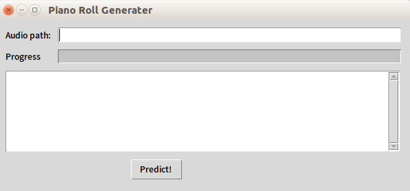
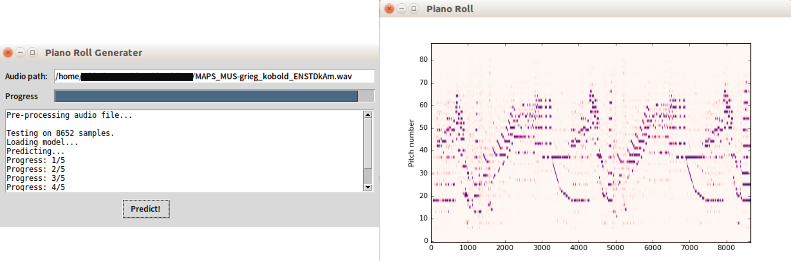

# CFP Program Visualization Project

This is the GUI version of CFP Neural Network. The library being used is python build-in, Tkinter.

To run the program, you need to install the following packages:
1. Tkinter
2. Keras
3. Tensorflow

And then:
1. open a terminal, run `python3 GUI.py`
2. input the path of audio that you want to analyze
3. press **Predict!**

There would be one output file and a new window shows the analyze result. It would looks like this:
 

The output file will be used for the part of performance. See details in README in [MusicVisualization folder](https://github.com/BreezeWhite/CFP_GUI/tree/master/MusicVisualization).

For the complete work of our study, please go check [here](https://github.com/BreezeWhite/CFP_NeuralNetwork).

## Attention !!
Here are two things to be awared of:
1. The input audio should only be .wav formated.
2. The program currently can only predict on pure piano performance.

So, that's all. Hope you can enjoy this project ^^

